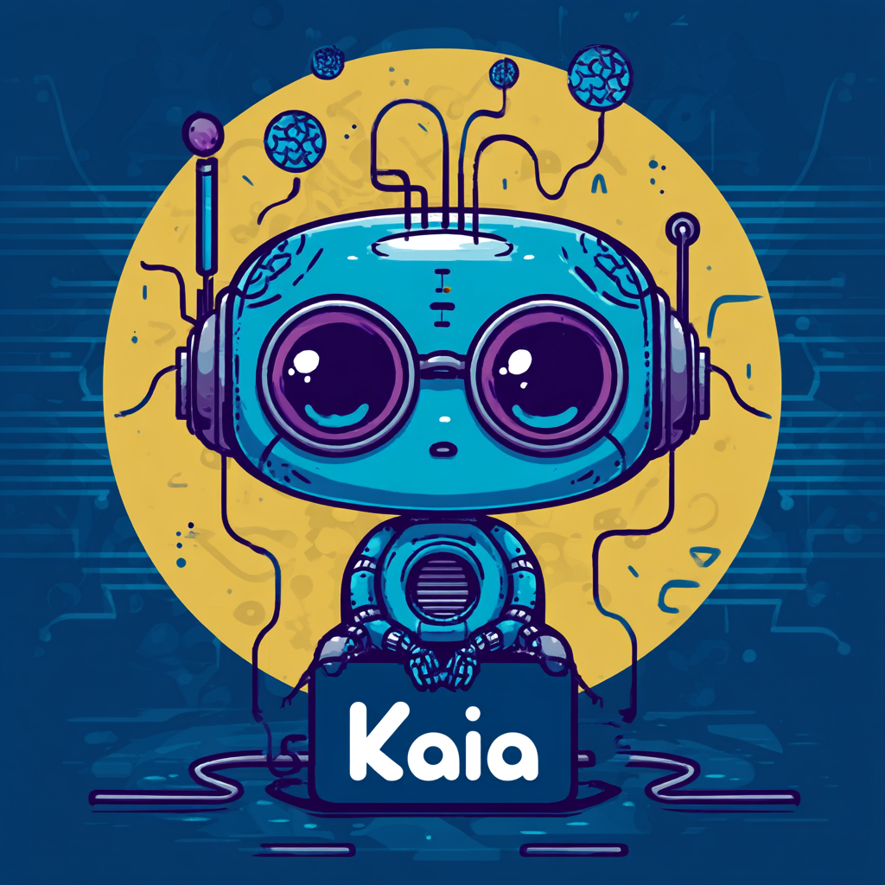

# Kaia - Kubernetes AI Assistant


Kaia is an intelligent Kubernetes Operations Assistant built with [pydantic-ai](https://ai.pydantic.dev/) that provides safe and expert-level Kubernetes cluster management through natural language interactions.

## Overview

Kaia serves as your AI-powered DevOps companion, offering:

- **Multi-Provider AI Support**: Choose from Ollama (local), Google Gemini, or GitHub Models
- **Safe Kubernetes Operations**: All kubectl commands executed through secure MCP (Model Context Protocol) server
- **Expert Guidance**: Comprehensive knowledge of Kubernetes best practices and troubleshooting
- **Interactive CLI**: Natural language interface for cluster management tasks
- **Containerized Security**: kubectl operations run in isolated Docker containers with read-only kubeconfig mounting

## Features

### 🤖 **Multiple AI Providers**
- **Ollama**: Run local models (llama2, mistral, etc.) for privacy and offline use
- **Google Gemini**: Advanced reasoning with latest Gemini models (gemini-2.0-flash, etc.)
- **GitHub Models**: Access to various models through GitHub's AI platform

### 🛡️ **Security & Safety**
- MCP-based kubectl execution prevents direct command injection
- Progressive change validation and impact assessment
- Namespace-aware operations with explicit targeting
- Resource validation before destructive operations
- Comprehensive error handling and retry logic

### 🔧 **Kubernetes Expertise**
- Cluster health monitoring and diagnostics
- Workload deployment, scaling, and management
- Troubleshooting pods, services, deployments, and resources
- Security configuration validation
- Performance optimization recommendations

### 💬 **Natural Language Interface**
- Conversational command interface
- Context-aware responses with technical explanations
- Alternative solution suggestions
- Educational explanations of Kubernetes concepts

## Prerequisites

- **Python 3.8+**
- **Docker** (installed and running)
- **Kubernetes cluster** access (kubeconfig in `~/.kube/config`)
- **AI Provider Setup** (see Provider Setup section)

## Installation

```bash
# Clone the repository
git clone https://github.com/otomato-gh/kaia.git

# Change into the project directory
cd kaia

# Install dependencies
pip install -r requirements.txt
```

## Provider Setup

### Ollama (Local Models) - Default
```bash
# Install Ollama
curl -fsSL https://ollama.com/install.sh | sh

# Pull a model
ollama pull llama2

# Start Ollama server
ollama serve

# Optional: Set custom model
export OLLAMA_MODEL_NAME=mistral
```

### Google Gemini
```bash
# Get API key from https://aistudio.google.com
export GEMINI_API_KEY=your_api_key_here

# Optional: Set custom model
export GEMINI_MODEL_NAME=gemini-2.0-flash
```

### GitHub Models
```bash
# Get GitHub personal access token
export GITHUB_TOKEN=your_github_token_here

# Optional: Set custom model  
export GITHUB_MODEL_NAME=gpt-4o
```

## Usage

### Basic Usage
```bash
# Use default provider (Ollama)
python kaia.py

# Specify provider
python kaia.py --provider gemini
python kaia.py --provider github
python kaia.py --provider ollama

# Get help
python kaia.py --help
```

### Example Interactions
```
Enter your Kubernetes request: show all pods in kube-system namespace

Enter your Kubernetes request: scale deployment nginx to 3 replicas

Enter your Kubernetes request: check why pod myapp-123 is failing

Enter your Kubernetes request: create a service for deployment webapp on port 80
```

### Exit
```
Enter your Kubernetes request: Thanks!
```

## Architecture

```
┌─────────────────┐    ┌──────────────────┐    ┌─────────────────────┐
│   Kaia (CLI)    │────│  AI Provider     │    │  Docker Container   │
│                 │    │  (Ollama/Gemini/ │    │                     │
│  - Natural Lang │    │   GitHub Models) │    │  k8s-mcp-server     │
│  - Validation   │    │                  │    │  - kubectl          │
│  - Safety       │    │  - Query Processing│   │  - istioctl         │
│  - Retries      │    │  - Response Gen  │    │  - helm             │
└─────────────────┘    └──────────────────┘    │  - argocd           │
         │                        │             └─────────────────────┘
         │                        │                        │
         └────────────────────────┼────────────────────────┘
                                  │
                            ┌─────▼──────┐
                            │ Kubernetes │
                            │  Cluster   │
                            └────────────┘
```

## Safety Features

- **Read-First Policy**: Always gather information before making changes
- **Single Command Execution**: One kubectl operation per interaction
- **Impact Assessment**: Explains potential effects before execution
- **Progressive Changes**: Encourages incremental modifications
- **Error Recovery**: Intelligent retry with corrected commands
- **Resource Validation**: Verifies names, namespaces, and parameters

## Development

### Project Structure
```
kaia/
├── kaia.py              # Main application
├── requirements.txt     # Python dependencies
├── README.md           # This file
└── kaia.png           # Logo
```

### Contributing
1. Fork the repository
2. Create a feature branch
3. Make your changes
4. Test with different providers
5. Submit a pull request

## Troubleshooting

### Common Issues

**MCP Server Connection**: Ensure Docker is running and the k8s-mcp-server image is available
```bash
docker pull ghcr.io/alexei-led/k8s-mcp-server:latest
```

**Provider Authentication**: Verify environment variables are set correctly
```bash
# Check current environment
env | grep -E "(OLLAMA|GEMINI|GITHUB)"
```

**Kubeconfig Access**: Ensure kubectl works locally
```bash
kubectl cluster-info
```

## License

This project is open source. See LICENSE file for details.

## Acknowledgments

- Built with [pydantic-ai](https://ai.pydantic.dev/)
- Kubernetes integration via [k8s-mcp-server](https://github.com/alexei-led/k8s-mcp-server)
- Inspired by the need for safe, intelligent Kubernetes operations